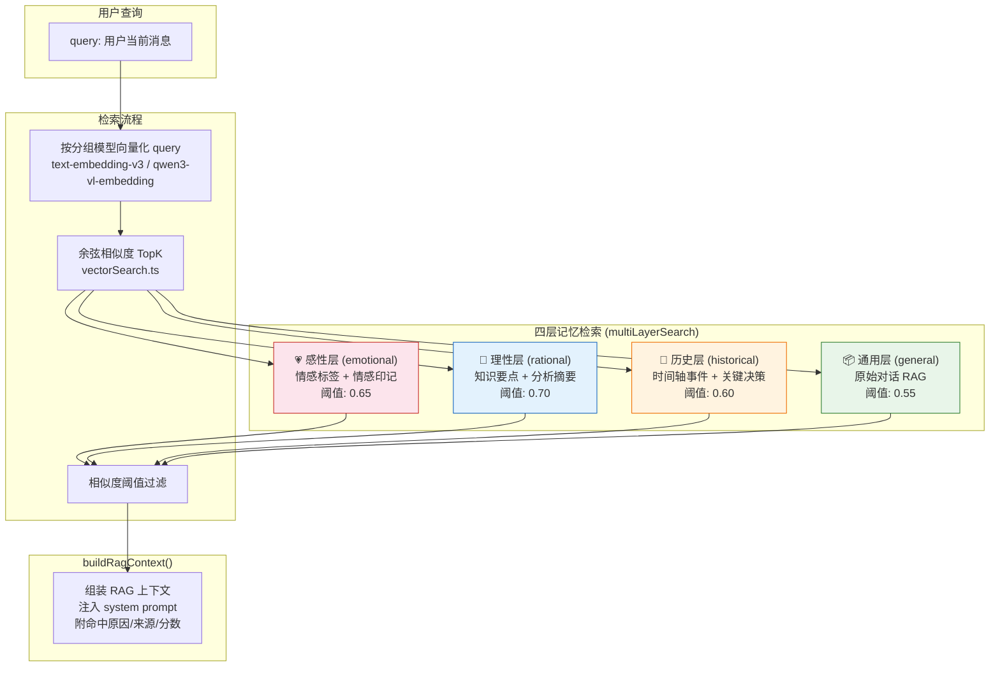
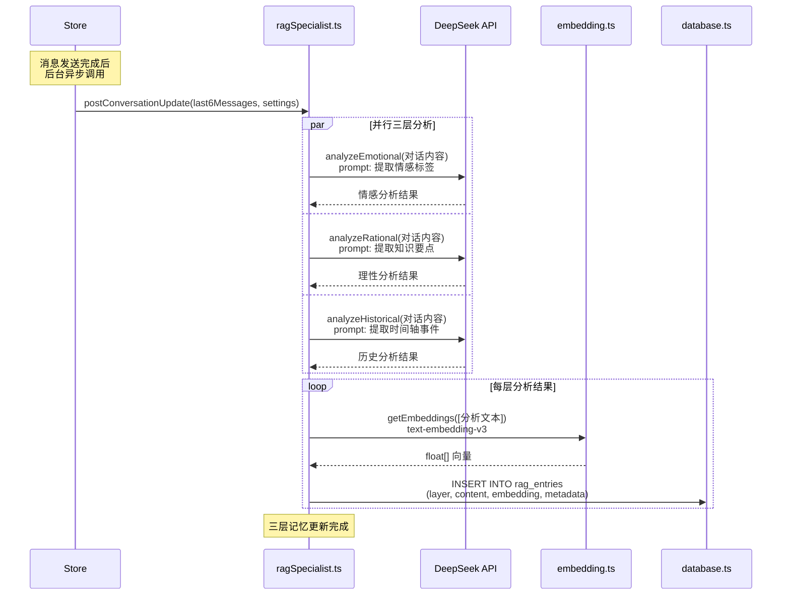
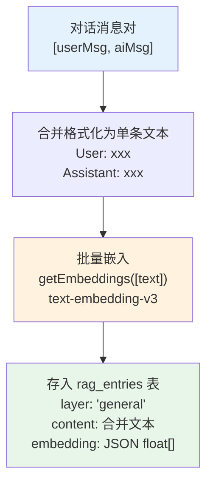
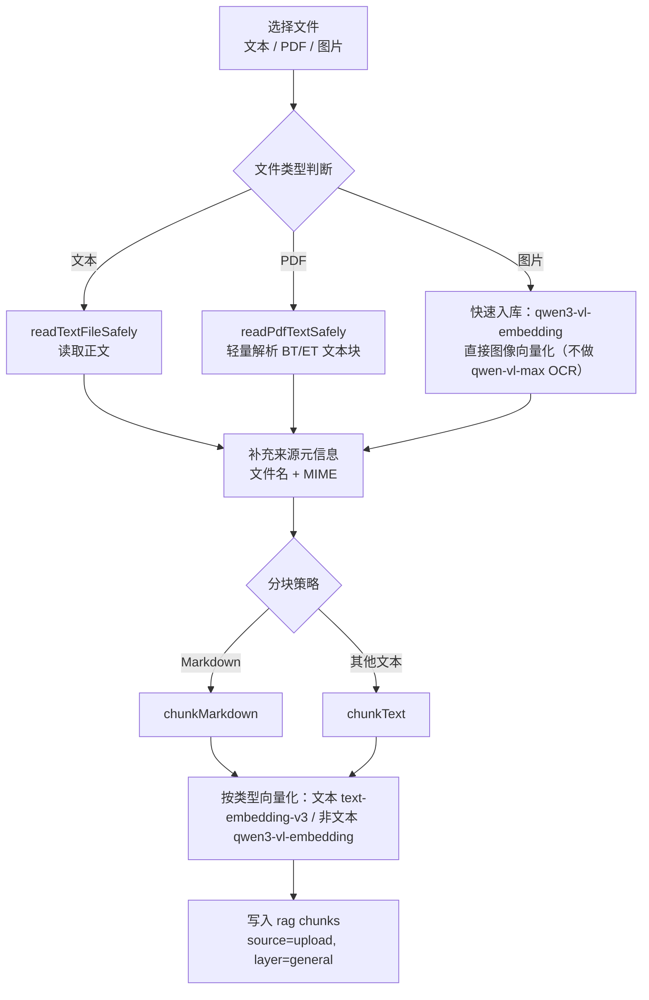
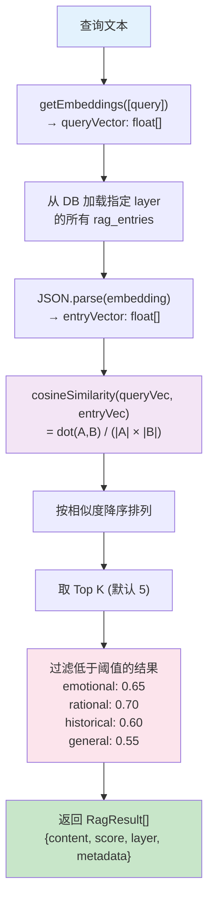
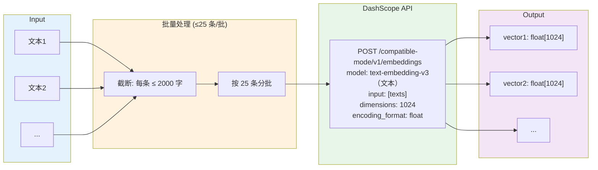
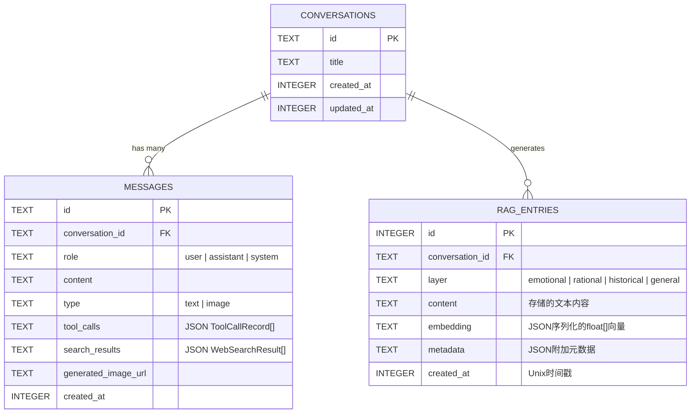

# 📚 多层 RAG 记忆架构

> V2.0：ragSpecialist.ts + rag.ts + embedding.ts + vectorSearch.ts + database.ts

---

## 1. 四层记忆系统总览

---

## 1.1 检索可解释增强（2026-05）

- `multiLayerSearch` 现为每条召回结果增加：
  - `hitReason`（命中原因）
  - `sourceId`（来源标识）
  - `embeddingModel`（命中向量模型）
- `buildRagContext` 在注入 system prompt 前，会输出：
  - 命中原因（层级语义 + 权重）
  - 引用信息（来源、embedding 模型、score）
- 目标：让回答依据可追踪，便于后续做“记忆治理（编辑/删除/纠偏）”。

---

## 2. 对话后处理更新流程 (postConversationUpdate)

---

## 3. 基础 RAG 存储流程 (addChatToRag)

---

## 3.1 多格式文件入库流程（rag.tsx + knowledgeIngest.ts）

说明：
- 批量导入按文件逐个处理，单文件失败不会阻断整体导入。
- PDF 为轻量文本提取，扫描版 PDF 可能无正文；此时仅保留元信息并给出提示。
- 图片入库依赖 DashScope Key，通过视觉模型提取文本后再进行 embedding。

---

## 4. 向量检索详解

---

## 5. Embedding 服务架构

---

## 6. 数据库 RAG 表结构

