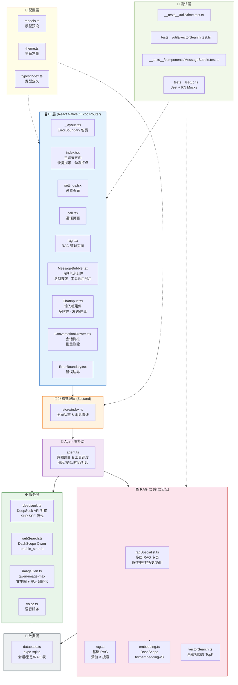
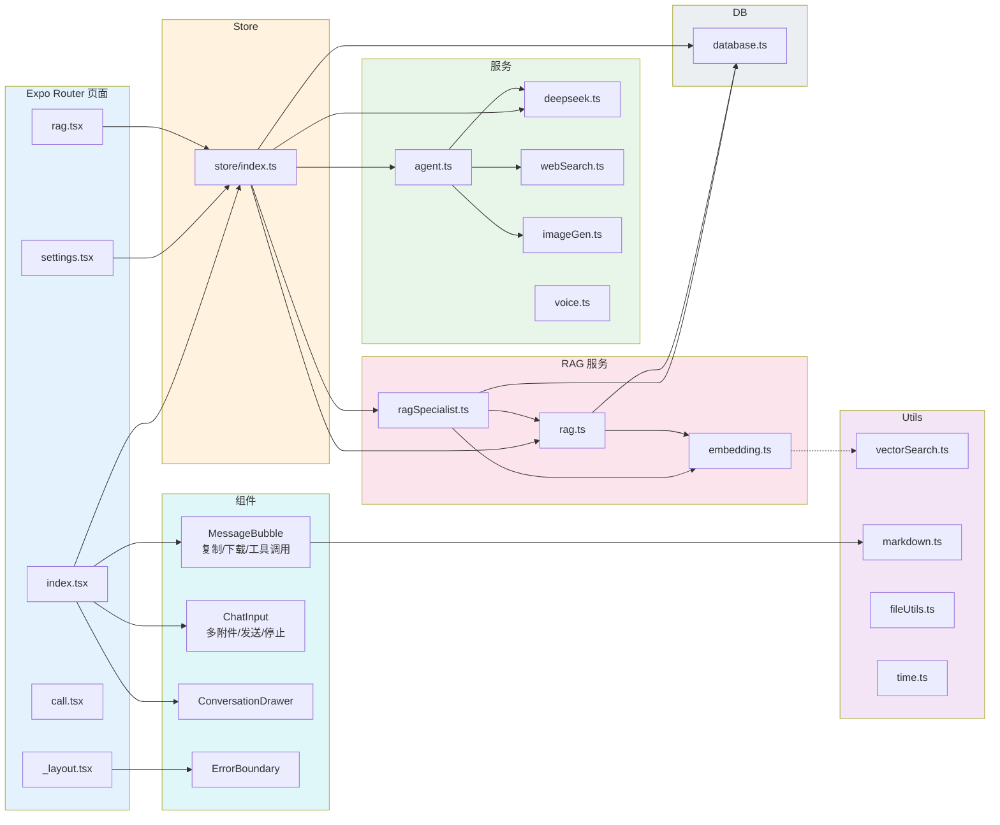

# 📐 项目总体架构图

> 更新时间：2026 年 · 基于当前代码库分析

---

## 1. 系统分层架构

---

## 2. 文件 / 模块依赖关系

---

## 3. 技术栈清单

| 层级 | 技术 | 用途 |
|------|------|------|
| 框架 | React Native + Expo SDK 54 | 跨平台移动应用 |
| 路由 | Expo Router (文件系统路由) | 页面导航 |
| 状态 | Zustand | 全局状态管理 |
| 数据库 | expo-sqlite | 本地 SQLite 持久存储 |
| LLM | DeepSeek API (OpenAI 兼容) | 主对话模型 |
| 搜索 | Aliyun DashScope (Qwen + enable_search) | 联网搜索增强 |
| 图片 | Aliyun DashScope (qwen-image-max) | AI 文生图 + LLM 提示词优化 |
| 嵌入 | Aliyun DashScope (text-embedding-v3 / qwen3-vl-embedding) | 文本/非文本向量化双路 |
| 视觉 | Aliyun DashScope (qwen-vl-max) | 图片理解（可串联联网搜索） |
| 流式 | XHR + SSE 手动解析 | 流式对话 (RN 不支持 ReadableStream) |
| Markdown | react-native-markdown-display | AI 回复渲染 |
| 语音 | expo-speech / expo-av | TTS / STT |
| 剪贴板 | expo-clipboard | AI 消息一键复制 |
| 动画 | React Native Animated API | 打点加载指示器 |

---

## 4. 主要 UI 交互改进（2026）

| 功能 | 说明 | 对标 |
|------|------|------|
| 动态打点指示器 | 三点弹跳动画替代静态"AI正在思考..." | ChatGPT / Claude |
| AI 消息复制按钮 | 每条 AI 消息气泡下方显示「复制」按钮，点击后变「✓ 已复制」 | ChatGPT / Kimi / 豆包 |
| 快捷提示语 | 空聊天状态展示 4 个示例提示（配置 API Key 后显示），一键发送 | ChatGPT / Claude |
| 多附件发送 | 同一轮可混合发送多张图片 + 多个文件 | 豆包 / Kimi |
| 批量删除对话 | 侧栏编辑模式 + 全选批量删除 | 主流 AI App |

---

## 5. 测试覆盖

| 测试文件 | 覆盖内容 | 用例数 |
|---------|---------|--------|
| `__tests__/utils/time.test.ts` | 时间快照、时间锚点注入、意图检测 | 13 |
| `__tests__/utils/vectorSearch.test.ts` | 余弦相似度、TopK 检索 | 12 |
| `__tests__/components/MessageBubble.test.ts` | Markdown 图片语法过滤 | 7 |
| 合计 | — | **32** |
